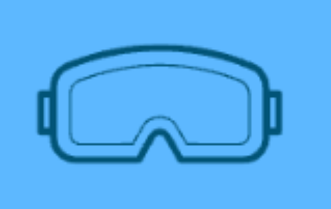

<a name="readme-top"></a>

[![Contributors][contributors-shield]][contributors-url]
[![Forks][forks-shield]][forks-url]
[![Stargazers][stars-shield]][stars-url]
[![Issues][issues-shield]][issues-url]
[![MIT License][license-shield]][license-url]
[![LinkedIn][linkedin-shield]][linkedin-url]


<!-- PROJECT LOGO -->
<br />
<div align="center">
  <a >
    
  </a>

  <h3 align="center">RentAll</h3>

</div>


<!-- TABLE OF CONTENTS -->
<details>
  <summary>Table of Contents</summary>
  <ol>
    <li>
      <a href="#about-the-project">About The Project</a>
      <ul>
        <li><a href="#built-with">Built With</a></li>
      </ul>
    </li>
    <li>
      <a href="#getting-started">Getting Started</a>
      <ul>
        <li><a href="#installation">Installation</a></li>
      </ul>
    </li>
    <li><a href="#usage">Usage</a></li>
    <li><a href="#roadmap">Roadmap</a></li>
    <li><a href="#contact">Contact</a></li>
    <li><a href="#acknowledgments">Acknowledgments</a></li>
  </ol>
</details>


<!-- ABOUT THE PROJECT -->
## About The Project

[![Product Name Screen Shot][product-screenshot]](https://example.com)

RentAll is an application where users can rent out various types of gear, games, or hardware, that others may just need for a few days, or just want to test out! Currently, to rent outdoor gear, one must go to a large, corporate, recreational store to rent out low quality equipment for too high of prices. Now, users can rent out their gear to whoever may need it!

<p align="right">(<a href="#readme-top">back to top</a>)</p>


### Built With

This section should list any major frameworks/libraries used to bootstrap your project. Leave any add-ons/plugins for the acknowledgements section. Here are a few examples.

* [![React][React.js]][React-url]
* [![Ruby][Ruby.rb]][Ruby-url]
* [![Tailwind][]][Tailwind-url]

<p align="right">(<a href="#readme-top">back to top</a>)</p>


### Installation

1. Clone the repo
   ```sh
   git clone git@github.com:kylebrackman/RentAll.git
   ```
2. Install NPM packages
   ```sh
   npm install --prefix client
   ```
3. Install gems
   ```sh
    bundle install
   ```

<p align="right">(<a href="#readme-top">back to top</a>)</p>


<!-- ROADMAP -->
## Roadmap & Bugs

- [ ] Add user chat for coordinating item dropoffs/pickups
- [ ] Fix Google Maps API issue
- [ ] Fix Tailwind CSS on mobile
- [ ] Add available and unavailable dates on each item calendar


<p align="right">(<a href="#readme-top">back to top</a>)</p>

<!-- CONTACT -->
## Contact

Kyle Brackman - kyle.a.brackman@gmail.com

Project Link: [https://github.com/kylebrackman/RentAll](https://github.com/kylebrackman/RentAll)

<p align="right">(<a href="#readme-top">back to top</a>)</p>


<!-- ACKNOWLEDGMENTS -->
## Acknowledgments

Use this space to list resources you find helpful and would like to give credit to. I've included a few of my favorites to kick things off!

* [GitHub Emoji Cheat Sheet](https://www.webpagefx.com/tools/emoji-cheat-sheet)
* [Img Shields](https://shields.io)
* [GitHub Pages](https://pages.github.com)
* [Font Awesome](https://fontawesome.com)
* [React Icons](https://react-icons.github.io/react-icons/search)

<p align="right">(<a href="#readme-top">back to top</a>)</p>


<!-- MARKDOWN LINKS & IMAGES -->
<!-- https://www.markdownguide.org/basic-syntax/#reference-style-links -->
[contributors-shield]: https://img.shields.io/github/contributors/othneildrew/Best-README-Template.svg?style=for-the-badge
[contributors-url]: https://github.com/othneildrew/Best-README-Template/graphs/contributors
[forks-shield]: https://img.shields.io/github/forks/othneildrew/Best-README-Template.svg?style=for-the-badge
[forks-url]: https://github.com/othneildrew/Best-README-Template/network/members
[stars-shield]: https://img.shields.io/github/stars/othneildrew/Best-README-Template.svg?style=for-the-badge
[stars-url]: https://github.com/othneildrew/Best-README-Template/stargazers
[issues-shield]: https://img.shields.io/github/issues/othneildrew/Best-README-Template.svg?style=for-the-badge
[issues-url]: https://github.com/othneildrew/Best-README-Template/issues
[linkedin-shield]: https://img.shields.io/badge/-LinkedIn-black.svg?style=for-the-badge&logo=linkedin&colorB=555
[linkedin-url]: https://www.linkedin.com/in/kyle-brackman/
[product-screenshot]: images/RentAll_Home_Page.png
[React.js]: https://img.shields.io/badge/React-20232A?style=for-the-badge&logo=react&logoColor=61DAFB
[React-url]: https://reactjs.org/
[Tailwind-url]: https://tailwindcss.com/
[Tailwind]: https://img.shields.io/badge/Tailwind-Blue
[Ruby-url]: https://www.ruby-lang.org/en/
[Ruby.rb]:https://camo.githubusercontent.com/3e54bb93c9b07f26583176c6d06d716fb4979496f742fc9eed7c9c5ba8befb27/68747470733a2f2f696d672e736869656c64732e696f2f62616467652f527562792d4343333432443f7374796c653d666c6174266c6f676f3d72756279266c6f676f436f6c6f723d626c61636b
